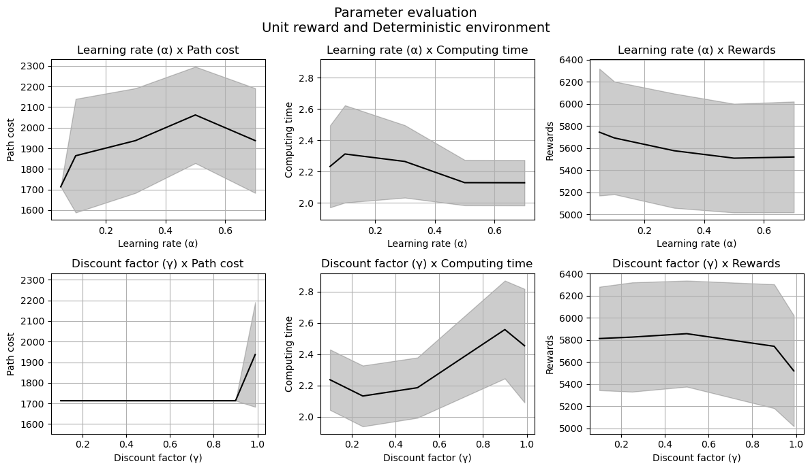
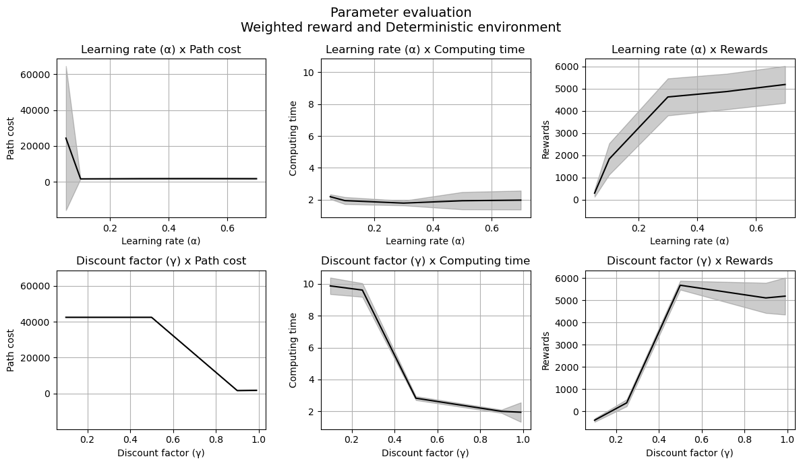
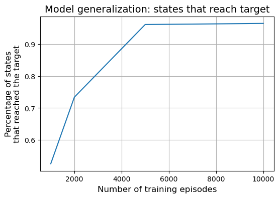
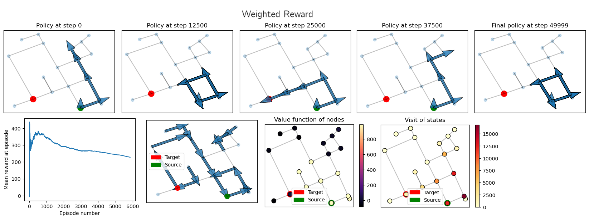
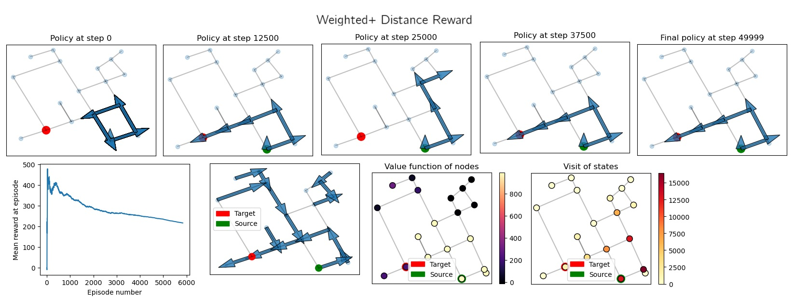
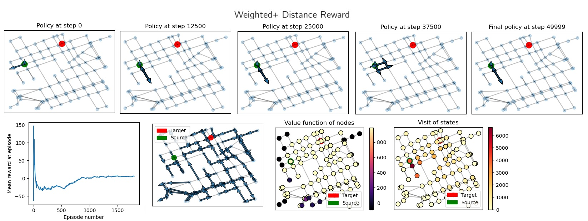
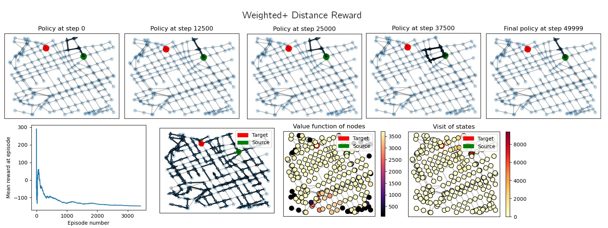

# Reinforcement Learning for Routing

Our objective is to use reinforcement learning in the problem of path finding for a trash collector truck. An optimized path can help in obtaining a faster and more efficient trash collection. The problem can be modeled as finding the shortest path between two nodes in a graph, which has already been previously solved using other optimization approaches, heuristics, and graph algorithms. However, we want to apply reinforcement learning to this problem both for educational purposes and compare it with other approaches.

 The problem can be defined as follows:

**Definition:** With a weighted directed graph $G = (V, E)$, and a starting node $v$, find the shortest path to node $u$, i.e., the subset of $E$ that connects $v$ to $u$ and has a minimal sum of edges weights.

## Reinforcement learning formulation

### Markov Decision Process

- Episodic: The episode ends when the agent arrives on the destination node or in a node without leaving edges.
- The time discretization occurs at the nodes of the graph, i.e., the crossings of the streets in which the agent needs to make a decision of which direction to follow.
- States: $n$ states $v_i \in V$, each is a node of the graph.
- Actions: $n$ actions, each one corresponds to moving to a specific node. It is important to note that the possible actions are dependent on each state. The action of moving to node $u$, if the state is node $v$, can only be made if there is an edge from $v$ to $u$.

### Rewards

There are two considered reward schemes:

- *Unit*: receives a reward of 10000 if reaches the goal, reward -1 for choosing to stay at the same position, -1000 if leaves to a dead end, and 0 for other possible actions (valid movements in the graph). It is a sparse reward scheme.
- *Weighted*: receives reward 10000 if reaches the goal, reward -1 for choosing to stay at the same position, -1000 if leaves to a dead end, and $-w_{u, v}$ for other possible actions (valid movements in the graph). $w_{u, v}$ is the weight of the edge between $u$ and $v$ normalized by the maximum weight of edges.

These reward setups were designed with the intent to force some behaviors in the agent. The negative reward of $-1$ is so that the agent does not learn to stay in the same position. The negative reward of $-1000$ at dead ends is also to force the agent to avoid dead ends with few visits. 

In the *unit* reward scheme, there is no use of the edge weights, so there is no information for the agent to learn the optimal path; the only objective is to reach the goal. In the *weighted* reward scheme, we incorporate the edge weights as negative rewards. As the objective is to obtain the path with the shortest path, we need to minimize the sum of the weights of the edges or maximize the negative of the sum. This could teach the model to stay at the same position, as both staying at the same position or selecting a new node will have negative weights. However, the weights are normalized, and only the maximum $w_{u, v}$ will be equal $-w_{u, v} = -11$ (the reward of staying in the same node).

### Environment

Our final goal is to be able to incorporate our learned algorithm into [SUMO](https://eclipse.dev/sumo/), a realistic simulation of urban mobility. However, to facilitate the initial study, we opted to implement our own environment using only numpy and networks to support graph objects. 

The environment keeps the current state of the simulation and has the `step` method. This method receives an action and, according to the current state, returns to the new state of performing this action. It also returns the reward obtained from the action. If the action is possible, i.e., there is an edge from $v$ to $u$, it performs the step and updates the state to $u$. Otherwise, the state stays at $v$. 

The environment can be deterministic or stochastic. The stochastic step has two extra details. First, an action has a random probability of not being possible (we used 5%). Secondly, we add a random Gaussian noise to the weights of the edges; this noise is sampled at each step, so the same edge will have different weights at different iterations. Our intention with this stochastic implementation is to simulate the uncertainty of transit; some streets can be randomly not accessible, and the cost of going through a street can also have different values depending on the day, time of the day, climate, etc.

## Experimentation setup

Each of the reinforcement learning models will have some parameters that need to be selected, and different scenarios have different optimal values. For that reason, a common experiment among all methods will be the study of the impact of parameter values on the path cost, computational time, and mean reward. It is also important to analyze how the agent works in the four possible scenarios of environment and reward: (deterministic, unit), (deterministic, weighted), (stochastic, unit), and (stochastic, weighted). Using a fixed source and target, for each value of a list of selected parameter values, we will execute the training with 20 different random seeds; this will permit us to obtain a distribution of the metrics.

## Monte-Carlo

## Q-learning

### Implementation details

Q-learning was implemented using the epsilon-greedy policy, with linear decay, achieving a value $\varepsilon_{\textrm{min}}$ at the final iteration. Both the $\varepsilon_{\textrm{max}}$ and $\varepsilon_{\textrm{min}}$ are parameters of the agent, however, there is no reason to have $\varepsilon_{\textrm{max}} \neq 1$. Another parameter was the learning rate $\alpha$, which was kept fixed during training (without learning rate decay). Good values for the learning rate are in the interval $[0, 1]$. Other parameters are the discount factor $\gamma$, the maximum number of steps per episode, and the number of episodes.

The Q-matrix was initialized with all values equal to $0$ and $-\infty$ in pairs $(s, a)$ that are not valid state-actions, i.e., pairs that there isn't an edge leaving node $s$ to $a$. The value $-\infty$ was used so that these pairs are not selected as the argmax values in the greedy policy. 

### Experiments

#### Parameters analysis

Our agent has two main parameters that need to be considered: the learning rate $\alpha$ and the weight of future rewards $\gamma$. The $\alpha$ values tested are $\{0.05, 0.1, 0.3, 0.5, 0.7\}$, and the $\gamma$ values are $\{0.1, 0.25, 0.5, 0.9, 0.99\}$. When varying $\alpha$, $\gamma = 0.99$, when varying $\gamma$, $\alpha = 0.7$. The experiments were performed with $1000$ episodes of $1000$ steps at max each.

The following figures present the results of our experiments. Looking at the first column, we see that every reward scheme and environment reached the optimal cost (around 1700) with some parameter value. The optimal policies were obtained with higher $\gamma$ values as expected. Looking at the figures of the unit reward scheme of deterministic and stochastic environments, we see that there is not a big relation between the parameter values and the metrics. Because there is no clear tendency to increase or decrease, and the deviation (a grey area) is really big.

Looking at the third column of the plots of weighted reward with deterministic or stochastic environment, we can see that the learning rate of 0.3 obtained high values of mean reward, and in the stochastic environment, a bigger learning rate resulted in lower performance. We can also see the positive outcome of increasing the discount factor.

#### Generalization

After identifying a good parameter value, it is important to evaluate if our agent is able to **generalize to different pairs of sources and targets using the different rewards and environments**. First, we selected 20 random source and target pairs and, using the optimal parameters found trained the agent to find the optimal paths. We saved the duration of the training, the average reward per episode,e and the ratio between the cost of the path found by our agent and the cost of the optimal path.

The next figure presents the results of this study, with three boxplots, one for each metric, showing the comparison between the reward schemes and environments. Looking first at the computing time, it is possible to see that there is not much difference, with all having around 2 seconds of computing time. Nextly, looking at the optimal path, we can see that despite all scenarios having the mean equal to 1 (it is really common to achieve the optimal path), using the weighted reward schemes, we obtained results with higher costs, the three quartile is around 1.6 times the cost of the optimal path. Next, looking at the rewards, we similarly obtained the same mean values, but the weighted environments had a bigger variance in the mean reward per episode; this could be caused because the 20 pairs of source and target will have different route costs. The overall analysis does not show that the scholastic environment was much harder in comparison to the deterministic.

The next analysis is to evaluate if an agent trained in a source and target pair can find a path from any of the states to the target and also if the path found is optimal. To do that, with a trained agent, we selected all possible states and calculated the route found by the policy to the target. We saved the information on whether the route was found and also the ratio of the cost found and the optimal cost.

The next figure shows the fraction of states such that the agent can start from and reach the target at different levels of training. It is possible to see that around 1000 training episodes, the agent can only reach the target from 50% of the states, but at 5000 episodes, it is able to reach more than 95% of the states. Following, we have another figure showing the routes found by the agent from the different sources (none of these sources were the ones that the model trained). It is possible to see that they have some intersections.

#### Value function

Another interesting analysis is to study how the value function learning by the agent differs at the unit and weighted reward scheme. To do that, we trained the two agents with 1000 episodes with each of the reward schemes. Then, the value function can be obtained from the Q matrix by calculating the maximum value of each state. The following plot shows all states colored by the value function; the more red, the higher the value function. By comparing both plots, we can see that in the unit reward, many nodes that are neighbors of the target have high values, but in the weighted, only a few of them have. This could be caused because the weighted reward scheme prioritizes the nodes with the shortest distance and not any node near the target.

### QLearning with Linear Function

A different implementation of eLearning with linear function as a function approximator was also developed. By using the function approximator, we do not store the matrix Q and use the features of the state and the action to calculate the value of the Q matrix. Our function approximator has the following formulation:

$$f(X(s, a)) = w_0 + \sum_{i=0}^k X(s, a)_k w_k $$

Where $k$ is the dimension of the feature vector, these weights are updated with gradient descent applied in the error of the Bellman Equation with a learning rate $\alpha$. This implementation was based on this [reference](https://gibberblot.github.io/rl-notes/single-agent/function-approximation.html).

Our problem presents a discrete nature and few features that could be used. We designed a few options of features:

- (x,y) coordinates of state, number of neighbors of state, (x, y) coordinates of action, number of neighbors of action (dim 6)
- one hot encoding of state, one hot encoding of action, and the same features of the previous item (dim 2n + 6)

By using the position of states, we consider that nodes that are spatially close will have similarities in the Q values. However, by trying a few tests with this approach, it did not obtain an optimal policy. Then, we extended the features by adding one hot encoding.

### Experiments

Similarly, we performed experiments to identify the optimal parameter values in the different environments and reward schemes. However, as the training is higher than in the QLearning with table, we only evaluated the learning rate parameter. The rates considered were $[0.05, 0.1, 0.3, 0.5]$. It was also necessary to train agents with 5000 episodes, as it was not obtaining good results with fewer steps.

The results are displayed in the following graphs. The black line represents the median values, and the grey region marks the 1-3 quartile intervals.

We can see that in the deterministic environment, when the learning rate increased, the path cost was reduced, computing time was reduced, and mean rewards increased. After the value of the learning rate $0.3$, all runs obtained the optimal cost. There is also not a big difference between the computing time of units and weighted reward schemes.

Looking at the stochastic environment, we see a curious pattern that only the learning rate equal to $0.3$ was able to obtain the optimal policy, while the other values were not. These results also do not present a big difference between the unit and weighted reward schemes.

## SARSA

## DQN

DQN was implemented based on the QLearning algorithm. It was developed with PyTorch and using the reference from the [CartPole tutorial](https://pytorch.org/tutorials/intermediate/reinforcement_q_learning.html). The neural network utilized will have an output layer of size $n$ (number of nodes) and was implemented with four layers with dimensions that are a function of the size of the graph. The hidden dimensions are $k, k, 1.5n, 1.5n, n$, in which $k$ is the dimension of the feature vector. The features were similar to the ones used in the function approximator, with that change that now the features are only about the state, not about the action, i.e., we have the one-hot encoding of state and the (x,y) positions.

The DQN used a replay buffer of size 10000, and at each iteration of the environment, samples were selected from this replay buffer to train the networks. A few changes were necessary to use the DQN:

- The training duration was defined in the number of steps, not in the number of episodes;
- The environment was used only with the deterministic approach;
- The unit reward scheme was not tested;
- A new reward scheme was designed that instead of returning $-w_{(s, a)}$ (cost of edge from $s$ to $a$), it returns $-d_{(a, t)}$, the spatial distance between the node $a$ and the target $t$. This reward scheme was designed to incentivize the model to go to states closer to the target.
- A new reward scheme was designed that returned $-0.5(w_{(s, a)} + d_{(s, a)})$;
- We did not permit the target and online policy to select invalid actions; the objective was to reduce the computational cost of fitting many invalid movements;

Based in the referece, at each step the weights of the target network $\theta_t$ are updated from the online netwotk $\theta_o$ following the rule: $\theta_t = \theta_t 0.005 + \theta_o 0.995$.

### Performance study

Our initial tests showed that it was really difficult for the agent to learn the optimal policy, and as the training time of a single agent took several miuntes, it was not possible to perform an exhaustive experiment of parameters. For that reason, we decided to apply it in smaller graphs and slowly increase the number of nodes of the graph to understand the capabilities of the agent. We can obtain smaller graphs by setting a radius and selecting only the network inside this radius. We tested this radius with sizes equal to 200, 400, and 600 and trained the enviroment with _weighted_ rewards and with _weighted+distance_ rewards.

#### Radius 200

Our first test with a radius of 200 and a weighted reward scheme was not able to achieve the optimal policy. We trained for 50,000 iterations. By looking at the policy at different steps, we can see that the agent finds the optmal policy, but later forgets it. The mean reward per episode starts decreasing after 1000 episodes. We can also verify that the value function makes sense (nods close to the target have higher value). By looking at the final policy of all states, we can see that we have almost the perfect path from source to target, missing only one edge. With the _weighted+distance_ reward scheme, we obtain a similar behavior of the mean rewards per episode, but the final policy is the optmal one.

One hypothesis for the bad performance of the DQN (it is well known that it is tricky) is that our state space and action space are discrete and really large. The output of the network will be a vector of size $n$, which can be $605$ in our experiments, a really unusual application of the DQN. 

## Contributions

- Enviroment: Giovani and Vitoria
- Monte Carlo: Vitoria
- QLearning: Giovani
- SARSA: Marcos
- DQN: Giovani
